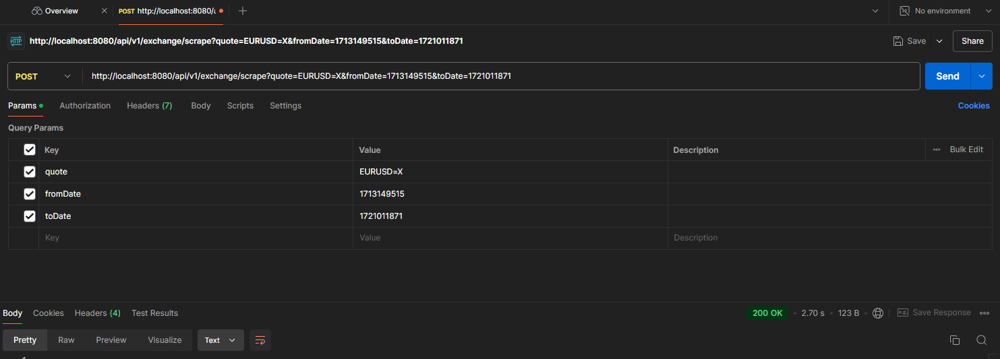
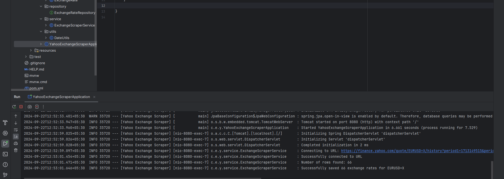

# Yahoo Finance Historical Exchange Rate Scraper

This project is a Java-based web scraping tool designed to extract historical exchange rate data from the Yahoo Finance website and store it in an in-memory H2 database.

## Table of Contents
- [Introduction](#introduction)
- [Features](#features)
- [Tech Stack](#tech-stack)
- [Setup and Usage](#setup-and-usage)
- [API Endpoints](#api-endpoints)
- [Database Schema](#database-schema)
- [Error Handling](#error-handling)
- [Example Output](#example-output)
- [Contact](#contact)

## Introduction

The Yahoo Finance Historical Exchange Rate Scraper allows users to scrape historical exchange rate data for specific currency pairs between given dates. The data is retrieved from Yahoo Finance and includes fields such as Date, Open, High, Low, Close, Adjusted Close, and Volume. This project stores the scraped data in an in-memory H2 database for easy access and testing.

## Features

- Scrapes historical exchange rate data for any given currency pair (e.g., EURUSD=X).
- Supports specifying date ranges using Unix timestamps.
- Stores data in an in-memory H2 database for easy access and testing.

## Tech Stack

- **Java 11**
- **Spring Boot 2.5.4**
- **Jsoup** - For web scraping
- **H2 Database** - In-memory database for storing scraped data
- **Lombok** - For reducing boilerplate code
- **SLF4J** - For logging

## Setup and Usage
1. Build the project:
    ```bash
    mvn clean install
    ```

2. Run the application:
    ```bash
    mvn spring-boot:run
    ```

3. Access the H2 console:
    - URL: `http://localhost:8080/h2-console`
    - JDBC URL: `jdbc:h2:mem:testdb`
    - Username: `sa`
    - Password: (leave blank)


## API Endpoints

- **GET /api/scrape**: Triggers the scraping process.
    - Parameters:
        - `quote`: Currency pair to scrape (e.g., `EURUSD=X`).
        - `fromDate`: Unix timestamp for start date.
        - `toDate`: Unix timestamp for end date.

Example Request:
```
GET /api/scrape?quote=EURUSD=X&fromDate=1713149515&toDate=1721011871
```

### API Response Example


## Database Schema

The data is stored in a single table `EXCHANGE_RATE` with the following schema:

| Field Name | Data Type | Description |
|------------|-----------|-------------|
| ID         | Long      | Auto-generated ID for each record |
| QUOTE      | String    | Currency pair (e.g., EURUSD=X)    |
| DATE       | Date      | Date of the exchange rate         |
| OPEN       | Double    | Opening price                     |
| HIGH       | Double    | Highest price                     |
| LOW        | Double    | Lowest price                      |
| CLOSE      | Double    | Closing price                     |
| ADJ_CLOSE  | Double    | Adjusted closing price            |
| VOLUME     | Long      | Trading volume                    |

## Error Handling

- If the data for a specific field is not available or malformed, it is stored as `null` or `0` (for volume).
- If the scraping process fails, an appropriate error message is logged.

## Example Output

### Console Output


### Sample Table Output
Sample output for a successful scrape:

| ID  | QUOTE    | DATE       | OPEN  | HIGH  | LOW   | CLOSE | ADJ_CLOSE | VOLUME |
|-----|----------|------------|-------|-------|-------|-------|-----------|--------|
| 1   | EURUSD=X | 2024-07-15 | 1.0886| 1.0922| 1.0884| 1.0886| 1.0886    | 0      |
| 2   | EURUSD=X | 2024-07-12 | 1.0873| 1.0911| 1.0863| 1.0873| 1.0873    | 0      |
| ... | ...      | ...        | ...   | ...   | ...   | ...   | ...       | ...    |

## Contact

For any queries, feel free to reach out:

- **Name**: Saksham Tiwari
- **Email**: saksham21.work@gmail.com
- **LinkedIn**: [Saksham Tiwari](https://www.linkedin.com/in/saksham-tiwari/)

---
