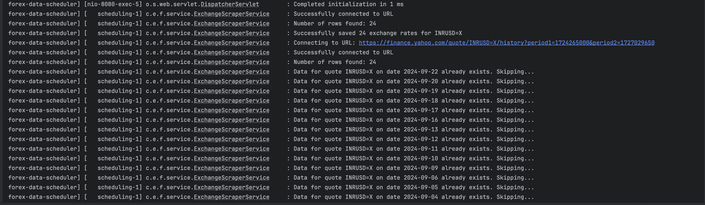
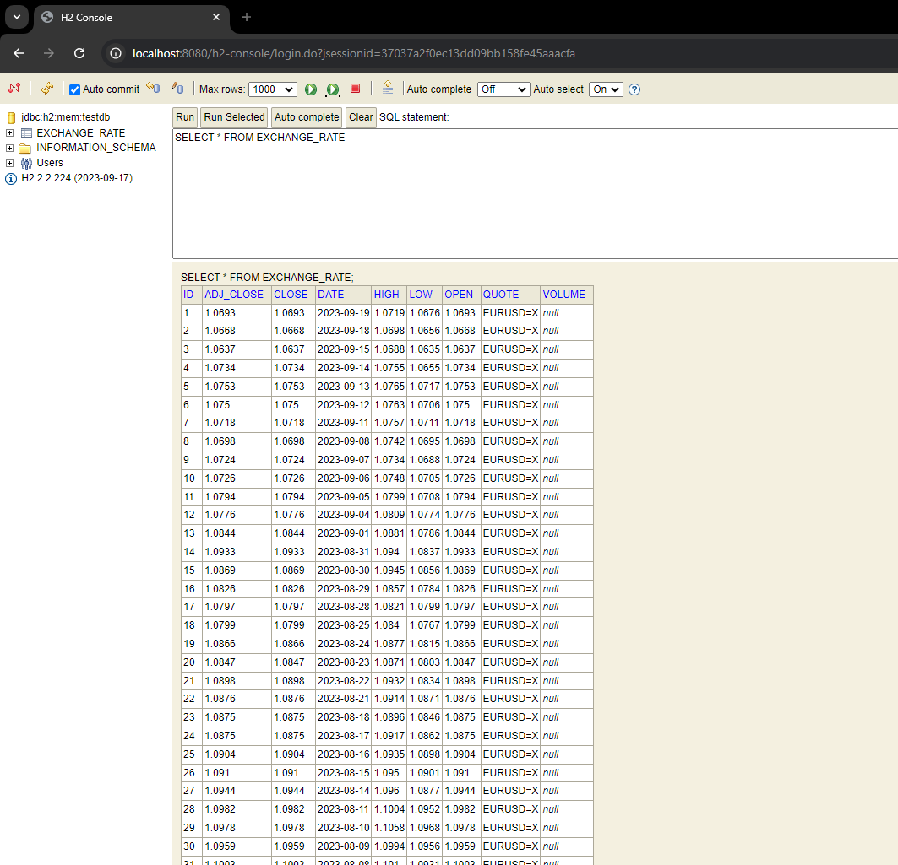
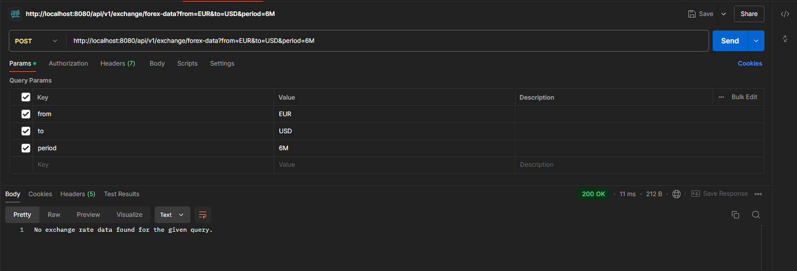
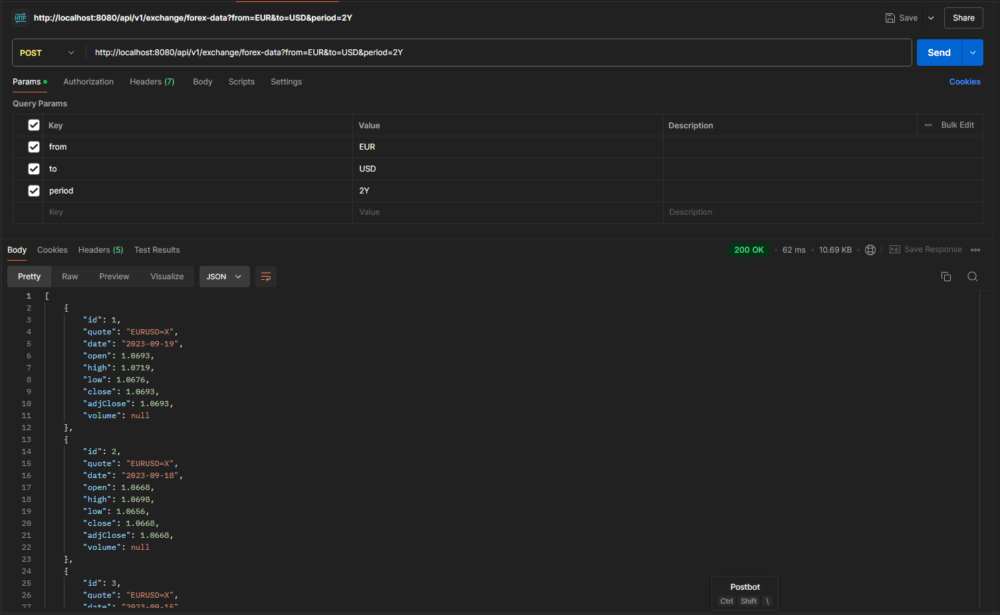

# Forex Data Scheduler - Subtask 2

This project is part of a larger application that scrapes historical exchange rate data from Yahoo Finance and provides a REST API for querying the stored data. In Subtask 2 of Task 2, we have implemented a scheduled job to periodically scrape data for specific currency pairs and store it in the in-memory H2 database while addressing duplicate data issues.

## Table of Contents
- [Introduction](#introduction)
- [Features](#features)
- [Tech Stack](#tech-stack)
- [Setup and Usage](#setup-and-usage)
- [Scheduled Jobs](#scheduled-jobs)
- [Duplicate Data Handling](#duplicate-data-handling)
- [Database Schema](#database-schema)
- [Error Handling](#error-handling)
- [Example Output](#example-output)
- [Limitations](#limitations)
- [Contact](#contact)

## Introduction

The Forex Data Scheduler periodically scrapes historical exchange rate data for specific currency pairs from Yahoo Finance. This subtask automates the data scraping process for predefined currency pairs and periods using Spring's scheduling capabilities, while also implementing a strategy to avoid storing duplicate data.

## Features

- Periodic data scraping for specified currency pairs.
- Duplicate data handling to ensure only new data is stored.
- Configurable schedules for weekly, monthly, quarterly, semi-annual, and annual scraping.
- Stores data in an in-memory H2 database for easy access and testing.

## Tech Stack

- **Spring Boot 2.5.4**
- **Spring Scheduling** - For automated data scraping.
- **H2 Database** - In-memory database for storing and querying scraped data.
- **Jsoup** - For web scraping.

## Setup and Usage
1. Build the project:
    ```bash
    mvn clean install
    ```

2. Run the application:
    ```bash
    mvn spring-boot:run
    ```

3. Access the H2 console:
    - URL: `http://localhost:8080/h2-console`
    - JDBC URL: `jdbc:h2:mem:testdb`
    - Username: `sa`
    - Password: (leave blank)

## Scheduled Jobs

The application has the following scheduled scraping jobs configured:

### INR-USD (for testing purposes)
- **Every 10 seconds**: Scrapes data for the `INRUSD=X` currency pair for the last 1 month.

### GBP-INR
- **Weekly (Every Monday at midnight)**: Scrapes data for the `GBPINR=X` currency pair for the last week.
- **Monthly (First day of every month at midnight)**: Scrapes data for the last month.
- **Quarterly (Every 3 months at midnight on the first day)**: Scrapes data for the last 3 months.
- **Semi-Annual (Every 6 months at midnight on the first day)**: Scrapes data for the last 6 months.
- **Yearly (First day of every year at midnight)**: Scrapes data for the last year.

### AED-INR
- **Weekly (Every Monday at 1 AM)**: Scrapes data for the `AEDINR=X` currency pair for the last week.
- **Monthly (First day of every month at 1 AM)**: Scrapes data for the last month.
- **Quarterly (Every 3 months at 1 AM on the first day)**: Scrapes data for the last 3 months.
- **Semi-Annual (Every 6 months at 1 AM on the first day)**: Scrapes data for the last 6 months.
- **Yearly (First day of every year at 1 AM)**: Scrapes data for the last year.

## Duplicate Data Handling

To address the issue of duplicate data, the following measures have been implemented:

- **Data Check Before Insert**: Before inserting a new record, the service checks if data for the same quote and date already exists in the database.
- **Logging Duplicates**: In case duplicate data is detected, a log entry is created for monitoring purposes.

### Duplicate Data Log Example


## Database Schema

The data is stored in a single table `EXCHANGE_RATE` with the following schema:

| Field Name | Data Type | Description |
|------------|-----------|-------------|
| ID         | Long      | Auto-generated ID for each record |
| QUOTE      | String    | Currency pair (e.g., GBPINR=X)    |
| DATE       | Date      | Date of the exchange rate         |
| OPEN       | Double    | Opening price                     |
| HIGH       | Double    | Highest price                     |
| LOW        | Double    | Lowest price                      |
| CLOSE      | Double    | Closing price                     |
| ADJ_CLOSE  | Double    | Adjusted closing price            |
| VOLUME     | Long      | Trading volume                    |

### Database Schema Image


## Error Handling

- If the data for a specific field is not available or malformed, it is stored as `null` or `0` (for volume).
- If the scraping process fails, an appropriate error message is logged.

### Error Message Example


## Example Output

### Postman Output


### Scheduling Logs
Logs showing the scheduled tasks being triggered.


## Limitations

- The scheduling intervals are fixed and cannot be dynamically altered without code changes.
- The H2 database resets on server restart, causing loss of stored data.

## Contact

For any queries, feel free to reach out:

- **Name**: Saksham Tiwari
- **Email**: saksham21.work@gmail.com
- **LinkedIn**: [Saksham Tiwari](https://www.linkedin.com/in/saksham-tiwari/)

---

